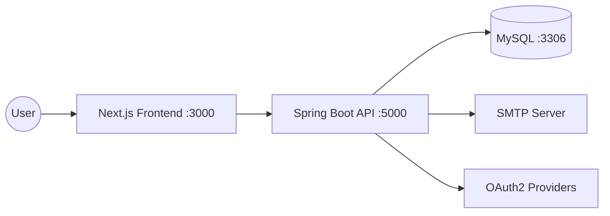

# 🚀 CaptionNova - Full-Stack Modern Media Application

CaptionNova is a high-performance, containerized full-stack application designed with modern DevOps principles. It features a robust Spring Boot backend and a lightning-fast Next.js frontend, all orchestrated via Docker for seamless development and deployment.

---

## 🛠️ Tech Stack

### **Backend (Microservice-Ready Architecture)**
- **Language & Framework:** [Java 21](https://www.oracle.com/java/technologies/downloads/) with [Spring Boot 4.0.3](https://spring.io/projects/spring-boot)
- **Security:** [Spring Security](https://spring.io/projects/spring-security) with JWT & OAuth2 (Google, GitHub)
- **Data Persistence:** [Spring Data JPA](https://spring.io/projects/spring-data-jpa) & [MySQL 8.0](https://www.mysql.com/)
- **Documentation:** [SpringDoc OpenAPI / Scalar UI](https://springdoc.org/)
- **Build Tool:** Maven

### **Frontend (Modern UI/UX)**
- **Framework:** [Next.js 15+](https://nextjs.org/) (App Router)
- **Language:** [TypeScript](https://www.typescriptlang.org/)
- **Styling:** [Tailwind CSS](https://tailwindcss.com/)
- **State Management:** [Zustand](https://zustand-demo.pmnd.rs/)

### **DevOps & Infrastructure**
- **Containerization:** [Docker](https://www.docker.com/) & [Docker Compose](https://docs.docker.com/compose/)
- **CI/CD:** [GitHub Actions](https://github.com/features/actions)
- **Environment Management:** Centralized `.env` configuration

---

## 🏗️ Architecture Overview



---

## 🚦 Getting Started

### **Prerequisites**
- [Docker Desktop](https://www.docker.com/products/docker-desktop/) installed.
- [Node.js](https://nodejs.org/) (optional, for local development).
- [JDK 21](https://adoptium.net/) (optional, for local development).

### **Quick Start (Docker Compose)**

1.  **Clone the repository:**
    ```bash
    git clone https://github.com/your-username/CaptionNova.git
    cd CaptionNova
    ```

2.  **Configure Environment Variables:**
    Ensure the root `.env` file is present and configured correctly.
    ```bash
    cp .env.example .env
    # Edit .env with your specific secrets
    ```

3.  **Spin up the environment:**
    ```bash
    docker-compose up -d --build
    ```

4.  **Access the applications:**
    - **Frontend:** [http://localhost:3000](http://localhost:3000)
    - **Backend API:** [http://localhost:5000](http://localhost:5000)
    - **API Documentation (Scalar/Swagger):** [http://localhost:5000/swagger-ui.html](http://localhost:5000/swagger-ui.html)

---

## ⚙️ Configuration (.env)

The root `.env` file manages all critical configurations:

| Variable | Description | Default |
| :--- | :--- | :--- |
| `DB_ROOT_PASSWORD` | MySQL Root Password | `********` |
| `DB_URL` | JDBC Connection URL | `jdbc:mysql://mysql:3306/captionnovadb` |
| `JWT_SECRET` | Secret key for JWT generation | `********` |
| `MAIL_USERNAME` | SMTP Username | `********` |
| `GOOGLE_CLIENT_ID` | OAuth2 Client ID | `********` |

---

## 🚀 CI/CD Pipeline

The project includes a robust **GitHub Actions** workflow (`.github/workflows/docker-image.yml`) that automates:
1.  **Code Sanitization:** Ensures secrets and environment variables are clean.
2.  **Multi-Stage Docker Builds:** Optimized builds for both Backend and Frontend.
3.  **Docker Hub Integration:** Automatically pushes versioned images to Docker Hub upon merge to `main`.

---

## 📂 Project Structure

```text
CaptionNova/
├── .github/workflows/       # CI/CD pipelines
├── caption-nova-backend/    # Spring Boot application
│   ├── src/                 # Java source code
│   └── Dockerfile           # Backend container definition
├── caption-nova-frontend/   # Next.js application
│   ├── app/                 # Next.js app router logic
│   └── Dockerfile           # Frontend container definition
├── docker-compose.yml       # Infrastructure orchestration
└── .env                     # Centralized environment config
```

---

## 🛡️ Security
- **JWT Authentication:** Secure stateless session management.
- **OAuth2:** Social login support for seamless user onboarding.
- **Health Checks:** MySQL container includes health probes to ensure dependency readiness.

---

## 📄 License
This project is licensed under the [MIT License](LICENSE).
